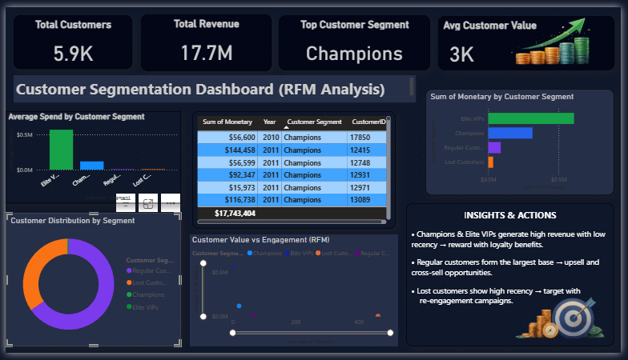

# End-to-End Customer Segmentation (RFM Analysis)

## 📌 Project Overview
This project transforms raw retail transaction data into actionable customer segments using Python (ETL & Machine Learning), SQL, and Power BI. The goal was to identify "High Value" and "At Risk" customers to optimize marketing strategies.

## 📊 Dashboard Preview

## 🛠️ Tech Stack
* **Python:** Pandas (Data Cleaning), Scikit-learn (K-Means Clustering)
* **SQL:** SQLite (Data Storage & Transformation)
* **Power BI:** Interactive Dashboard & DAX Measures
* **Data Engineering:** ETL Pipeline automation

## 🔍 Key Insights
* Identified **4 distinct customer segments**: Champions, Regular, At Risk, and Lost.
* **"Elite VIPs"** make up only **0.4%** of the customer base but contribute significantly to total revenue.
* **$17M** in revenue identified within the "At Risk" segment for re-engagement campaigns.

## 📂 Project Structure
* `analysis.ipynb`: The Jupyter Notebook containing the full ETL and Clustering code.
* `Customer_Segmentation.pbix`: The Power BI Dashboard file.
* `customer_segments_final.csv`: The processed dataset with cluster labels.
